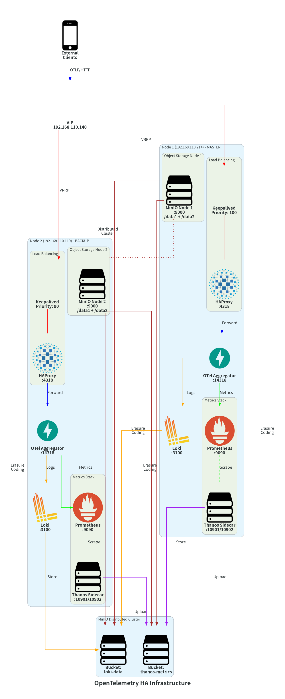

# OpenTelemetry High Availability Infrastructure Documentation

## Overview

This document describes the High Availability (HA) OpenTelemetry infrastructure deployed across two nodes with automatic failover capabilities.

## Architecture Diagram



## Infrastructure Summary

### Node Information

| Node | IP Address | Role | Hostname |
|------|-----------|------|----------|
| Node 1 | 192.168.110.214 | MASTER | ish-otel-mid-1.novalocal |
| Node 2 | 192.168.110.119 | BACKUP | ish-otel-mid-2.novalocal |
| Virtual IP | 192.168.110.140 | Shared VIP | - |

### High Availability Components

- **Keepalived**: VRRP-based virtual IP management
  - Node 1: Priority 100 (MASTER)
  - Node 2: Priority 90 (BACKUP)
  - Router ID: 51
  - Virtual IP: 192.168.110.140

- **HAProxy**: Load balancer and traffic routing
  - OTLP HTTP endpoint: Port 4318
  - Stats endpoint: Port 8404
  - Backend: Local OTel Aggregator on port 14318

### Service Stack

Both nodes run identical service stacks:

#### 1. OpenTelemetry Collector (Aggregator)
- **Image**: `cmp-otel-aggregator` (custom build based on `otel/opentelemetry-collector-contrib:0.139.0`)
- **Ports**:
  - 14318/tcp: OTLP HTTP receiver
  - 14317/tcp: OTLP gRPC receiver
  - 9464/tcp: Prometheus metrics endpoint
- **Functionality**:
  - Receives OTLP metrics and logs
  - Processes with batch, memory limiter, and resource processors
  - Exports metrics to Prometheus via remote write
  - Exports logs to Loki via OTLP/HTTP

#### 2. Prometheus
- **Image**: `prom/prometheus:v3.7.3`
- **Port**: 9090
- **Configuration**:
  - Scrape interval: 5s
  - Evaluation interval: 15s
  - Retention: 15 days
  - Block duration: 2h (min/max)
  - External labels: cluster='monitoring-ha', replica='node1'
- **Storage**: `/data/volume/otel/prometheus`
- **Scrape targets**:
  - prometheus (self): localhost:9090
  - otel-aggregator: otel-aggregator:9464
  - thanos-sidecar: thanos-sidecar:10902

#### 3. Thanos Sidecar
- **Image**: `thanosio/thanos:v0.40.1`
- **Ports**:
  - 10901: gRPC
  - 10902: HTTP
- **Functionality**:
  - Uploads Prometheus blocks to MinIO S3 storage
  - Provides long-term metrics storage
  - Enables multi-cluster querying
- **Storage backend**: MinIO S3-compatible object storage
- **Bucket**: `thanos-metrics`

#### 4. Loki
- **Image**: `grafana/loki:3.4.2`
- **Port**: 3100
- **Configuration**:
  - Schema: v13 (TSDB)
  - Storage: S3-compatible (MinIO)
  - Retention: 90 days
  - Bucket: `loki-data`
- **Storage paths**:
  - Chunks: `/loki/chunks`
  - Rules: `/loki/rules`
  - Index: `/loki/index`
  - Cache: `/loki/cache`

#### 5. MinIO (Distributed Mode)
- **Image**: `cmp-minio` (custom build based on `minio/minio:RELEASE.2025-02-07T23-21-09Z`)
- **Ports**:
  - 9000: S3 API
  - 9001: Web Console
- **Mode**: Distributed with erasure coding
- **Nodes**:
  - `http://192.168.110.214:9000/data{1...2}`
  - `http://192.168.110.119:9000/data{1...2}`
- **Buckets**:
  - `loki-data`: Loki log storage
  - `thanos-metrics`: Thanos metrics storage
- **Volumes per node**:
  - `/data/volume/otel/minio/data1`
  - `/data/volume/otel/minio/data2`

### Network Architecture

```
External Clients
      |
      | OTLP/HTTP
      v
Virtual IP (192.168.110.140:4318)
      |
      | VRRP (Keepalived)
      v
+-----+------+
|            |
v            v
Node 1       Node 2
HAProxy      HAProxy
:4318        :4318
|            |
v            v
OTel         OTel
Aggregator   Aggregator
:14318       :14318
|            |
+-----+------+
      |
      +---> Prometheus :9090 (metrics)
      +---> Loki :3100 (logs)
```

## Data Flow

### Metrics Pipeline

1. **Ingestion**: External clients send OTLP metrics to VIP:4318
2. **Load Balancing**: HAProxy forwards to local OTel Aggregator:14318
3. **Processing**: OTel Collector processes with:
   - Memory limiter (4GB limit, 1GB spike)
   - Batch processor (1024 batch size)
   - Resource processor (adds aggregator node label)
4. **Storage**:
   - Metrics written to local Prometheus via remote write API
   - Prometheus stores with 15-day retention
5. **Long-term Storage**:
   - Thanos Sidecar uploads 2h blocks to MinIO S3
   - Distributed across 4 data volumes (2 per node)

### Logs Pipeline

1. **Ingestion**: External clients send OTLP logs to VIP:4318
2. **Load Balancing**: HAProxy forwards to local OTel Aggregator:14318
3. **Processing**: OTel Collector processes logs
4. **Storage**:
   - Logs sent to Loki via OTLP/HTTP
   - Loki stores in MinIO S3 (loki-data bucket)
   - 90-day retention period

## High Availability Features

### Automatic Failover

- **Keepalived VRRP**: Monitors HAProxy health
- **Health Check**: `/usr/bin/killall -0 haproxy` every 2 seconds
- **Failover Time**: ~3 seconds (advert_int: 1 second)
- **Authentication**: PASS auth with shared password

### Data Redundancy

- **MinIO Erasure Coding**: Distributed across 4 data volumes
- **Prometheus Blocks**: Uploaded to MinIO for redundancy
- **Loki Data**: Stored in distributed MinIO cluster

### Health Checks

All services include comprehensive health checks:

| Service | Health Check Endpoint | Interval | Start Period |
|---------|----------------------|----------|--------------|
| HAProxy | Config validation | 10s | 120s |
| MinIO | http://127.0.0.1:9000/minio/health/live | 10s | 120s |
| OTel Aggregator | http://127.0.0.1:9464/metrics | 10s | 120s |
| Prometheus | http://127.0.0.1:9090/-/healthy | 10s | 120s |
| Thanos Sidecar | http://127.0.0.1:10902/-/healthy | 10s | 120s |
| Loki | http://127.0.0.1:3100/metrics | 10s | 120s |

## Configuration Files

### Node 1 (192.168.110.214)

Configuration files are located in `/data/docker/otel/` and backed up to `node1-192.168.110.214/`:

- `docker-compose.yaml`: Main orchestration file
- `.env`: Node-specific environment variables
- `Dockerfile`: OTel Collector custom image
- `haproxy/haproxy.cfg`: HAProxy configuration
- `keepalived/keepalived.conf.template`: Keepalived template
- `keepalived/setup-keepalived.sh`: Keepalived initialization script
- `loki/config.yaml`: Loki configuration
- `minio/Dockerfile`: MinIO custom image
- `minio/run.sh`: MinIO initialization and bucket setup script
- `otel-collector/config.yaml`: OTel Collector pipeline configuration
- `prometheus/prometheus.yml`: Prometheus scrape configuration
- `thanos/bucket.yml`: Thanos S3 bucket configuration

### Node 2 (192.168.110.119)

Configuration files are identical to Node 1, with only `.env` differences:

- `NODE_NAME=mid-2` (vs `mid-1`)
- `NODE_IP=192.168.110.119` (vs `192.168.110.214`)
- `PEER_IP=192.168.110.214` (vs `192.168.110.119`)
- `KEEPALIVED_PRIORITY=90` (vs `100`)
- `KEEPALIVED_STATE=BACKUP` (vs `MASTER`)

All configuration files are backed up to `node2-192.168.110.119/`.

## Volume Mappings

### Node 1 & Node 2 (Identical)

| Service | Container Path | Host Path |
|---------|---------------|-----------|
| Prometheus | `/prometheus` | `/data/volume/otel/prometheus` |
| Thanos | `/prometheus` | `/data/volume/otel/prometheus` |
| Thanos | `/thanos` | `/data/volume/otel/thanos` |
| Loki | `/loki` | `/data/otel/volume/loki` |
| MinIO | `/data1` | `/data/volume/otel/minio/data1` |
| MinIO | `/data2` | `/data/volume/otel/minio/data2` |

## Port Matrix

| Service | Node 1 | Node 2 | Protocol | Purpose |
|---------|--------|--------|----------|---------|
| VIP (HAProxy) | 192.168.110.140:4318 | 192.168.110.140:4318 | HTTP | OTLP HTTP ingestion |
| HAProxy Stats | :8404 | :8404 | HTTP | HAProxy statistics |
| OTel Aggregator HTTP | :14318 | :14318 | HTTP | OTLP HTTP receiver |
| OTel Aggregator gRPC | :14317 | :14317 | gRPC | OTLP gRPC receiver |
| OTel Metrics | :9464 | :9464 | HTTP | Prometheus scrape endpoint |
| Prometheus | :9090 | :9090 | HTTP | Prometheus API/UI |
| Thanos gRPC | :10901 | :10901 | gRPC | Thanos query protocol |
| Thanos HTTP | :10902 | :10902 | HTTP | Thanos HTTP API |
| Loki | :3100 | :3100 | HTTP | Loki API |
| MinIO S3 | :9000 | :9000 | HTTP | S3-compatible API |
| MinIO Console | :9001 | :9001 | HTTP | Web UI |

## Container Status

### Node 1 (192.168.110.214)

All containers running and healthy:
- haproxy-mid-1
- thanos-sidecar-mid-1
- loki-mid-1
- prometheus-mid-1
- minio-mid-1
- keepalived-mid-1
- otel-aggregator-mid-1

### Node 2 (192.168.110.119)

All containers running and healthy:
- haproxy-mid-2
- thanos-sidecar-mid-2
- loki-mid-2
- prometheus-mid-2
- minio-mid-2
- keepalived-mid-2
- otel-aggregator-mid-2

## Deployment Instructions

### Prerequisites

1. Docker and Docker Compose installed on both nodes
2. Network connectivity between nodes (192.168.110.214 and 192.168.110.119)
3. Storage volumes created at `/data/volume/otel/` and `/data/otel/volume/`

### Deployment Steps

1. **On each node**, create directory structure:
   ```bash
   mkdir -p /data/docker/otel
   cd /data/docker/otel
   ```

2. **Copy configuration files**:
   - For Node 1: Use files from `node1-192.168.110.214/`
   - For Node 2: Use files from `node2-192.168.110.119/`

3. **Build custom images**:
   ```bash
   docker-compose build
   ```

4. **Start services**:
   ```bash
   docker-compose up -d
   ```

5. **Verify health**:
   ```bash
   docker-compose ps
   docker-compose logs -f
   ```

### Testing Failover

1. **Check current VIP holder**:
   ```bash
   ip addr show | grep 192.168.110.140
   ```

2. **Stop Keepalived on master**:
   ```bash
   docker stop keepalived-mid-1
   ```

3. **Verify VIP moved to backup**:
   ```bash
   # On Node 2
   ip addr show | grep 192.168.110.140
   ```

4. **Test OTLP ingestion**:
   ```bash
   curl -X POST http://192.168.110.140:4318/v1/metrics \
     -H "Content-Type: application/json" \
     -d '{"resourceMetrics":[]}'
   ```

## Monitoring and Observability

### Access Points

- **HAProxy Stats**: http://192.168.110.214:8404/stats (Node 1) or http://192.168.110.119:8404/stats (Node 2)
- **Prometheus UI**: http://192.168.110.214:9090 (Node 1) or http://192.168.110.119:9090 (Node 2)
- **MinIO Console**: http://192.168.110.214:9001 (Node 1) or http://192.168.110.119:9001 (Node 2)
- **OTel Metrics**: http://192.168.110.214:9464/metrics (Node 1) or http://192.168.110.119:9464/metrics (Node 2)
- **Thanos Sidecar**: http://192.168.110.214:10902 (Node 1) or http://192.168.110.119:10902 (Node 2)

### Key Metrics to Monitor

- **Keepalived**: VIP ownership, VRRP state
- **HAProxy**: Backend health, request rate, response times
- **OTel Collector**: Receiver accepted/refused metrics, exporter sent/failed metrics
- **Prometheus**: Ingestion rate, storage usage, query latency
- **Thanos**: Upload success rate, block compaction status
- **Loki**: Ingestion rate, query performance
- **MinIO**: Storage usage, API latency, erasure coding health

## Troubleshooting

### Common Issues

1. **VIP not responding**:
   - Check Keepalived logs: `docker logs keepalived-mid-1`
   - Verify VRRP authentication matches on both nodes
   - Check firewall rules for VRRP (protocol 112)

2. **HAProxy backend down**:
   - Check OTel Aggregator health: `curl http://127.0.0.1:9464/metrics`
   - Review HAProxy logs: `docker logs haproxy-mid-1`

3. **MinIO bucket creation failed**:
   - Check MinIO logs: `docker logs minio-mid-1`
   - Verify distributed mode connectivity between nodes
   - Check network connectivity on port 9000

4. **Thanos not uploading blocks**:
   - Verify MinIO bucket access: Check `thanos/bucket.yml` credentials
   - Check Thanos logs: `docker logs thanos-sidecar-mid-1`
   - Verify Prometheus block creation: Check `/data/volume/otel/prometheus`

5. **Loki ingestion issues**:
   - Check Loki logs: `docker logs loki-mid-1`
   - Verify MinIO bucket permissions
   - Check OTel Collector exporter config

## Security Considerations

### Current Configuration

- MinIO uses hardcoded credentials (should be rotated regularly)
- Keepalived authentication uses shared password
- All services run in host network mode (network_mode: host)
- No TLS/SSL encryption configured (insecure: true)

### Recommendations

1. **Enable TLS**:
   - Configure TLS for all HTTP endpoints
   - Use proper certificates (not self-signed in production)

2. **Secrets Management**:
   - Use Docker secrets or external secrets manager
   - Rotate MinIO credentials regularly
   - Use strong, unique passwords

3. **Network Isolation**:
   - Consider using Docker networks instead of host mode
   - Implement firewall rules to restrict access
   - Use VPN or private network for inter-node communication

4. **Access Control**:
   - Enable authentication on Prometheus and Loki
   - Restrict MinIO console access
   - Implement role-based access control (RBAC)

## Backup and Disaster Recovery

### Data Backup

1. **MinIO Data**:
   - Regularly backup `/data/volume/otel/minio/` on both nodes
   - Consider MinIO bucket replication to external storage

2. **Prometheus Data**:
   - Thanos provides long-term storage in MinIO
   - Backup MinIO `thanos-metrics` bucket

3. **Loki Data**:
   - Stored in MinIO `loki-data` bucket
   - Backup bucket or configure multi-site replication

4. **Configuration Files**:
   - All files backed up in `node1-192.168.110.214/` and `node2-192.168.110.119/`
   - Version control recommended (Git)

### Disaster Recovery Procedures

1. **Single Node Failure**:
   - Keepalived automatically fails over to backup node
   - No manual intervention required
   - Replace failed node and rejoin cluster

2. **Complete Cluster Failure**:
   - Restore MinIO data volumes from backup
   - Deploy containers using saved configuration files
   - Verify MinIO distributed mode connectivity
   - Start services in order: MinIO → Prometheus/Loki → Thanos → OTel → HAProxy → Keepalived

3. **Data Corruption**:
   - MinIO erasure coding provides protection
   - Restore from backup if corruption affects multiple nodes
   - Check Thanos compaction logs for metric recovery

## Performance Tuning

### Current Settings

- **OTel Collector**:
  - Memory limit: 4GB (spike: 1GB)
  - Batch size: 1024 (max: 2048)
  - Batch timeout: 10s

- **Prometheus**:
  - Scrape interval: 5s
  - Retention: 15 days
  - Block duration: 2h

- **Loki**:
  - Retention: 90 days

### Optimization Recommendations

1. **Increase batch size** if experiencing high throughput
2. **Adjust scrape intervals** based on metric cardinality
3. **Tune retention periods** based on storage capacity
4. **Configure resource limits** in docker-compose for better isolation
5. **Enable compression** in OTel Collector exporters

## Future Enhancements

1. **Grafana Integration**: Add Grafana for visualization
2. **Alertmanager**: Integrate Prometheus Alertmanager for alerting
3. **Thanos Query**: Deploy Thanos Query component for global view
4. **Multi-site Replication**: Add third site for geo-redundancy
5. **Kubernetes Migration**: Consider migrating to Kubernetes for better orchestration
6. **Service Mesh**: Implement Istio or Linkerd for traffic management
7. **Centralized Logging**: Add Promtail for system log collection

## References

- OpenTelemetry Collector: https://opentelemetry.io/docs/collector/
- Prometheus: https://prometheus.io/docs/
- Thanos: https://thanos.io/
- Loki: https://grafana.com/docs/loki/
- MinIO: https://min.io/docs/
- HAProxy: http://www.haproxy.org/
- Keepalived: https://www.keepalived.org/

## Contact and Support

For issues or questions regarding this infrastructure:

1. Check logs: `docker-compose logs -f [service-name]`
2. Review health checks: `docker-compose ps`
3. Consult this documentation
4. Review upstream project documentation

---

**Last Updated**: 2025-11-14
**Infrastructure Version**: 1.0
**Maintained By**: Infrastructure Team
