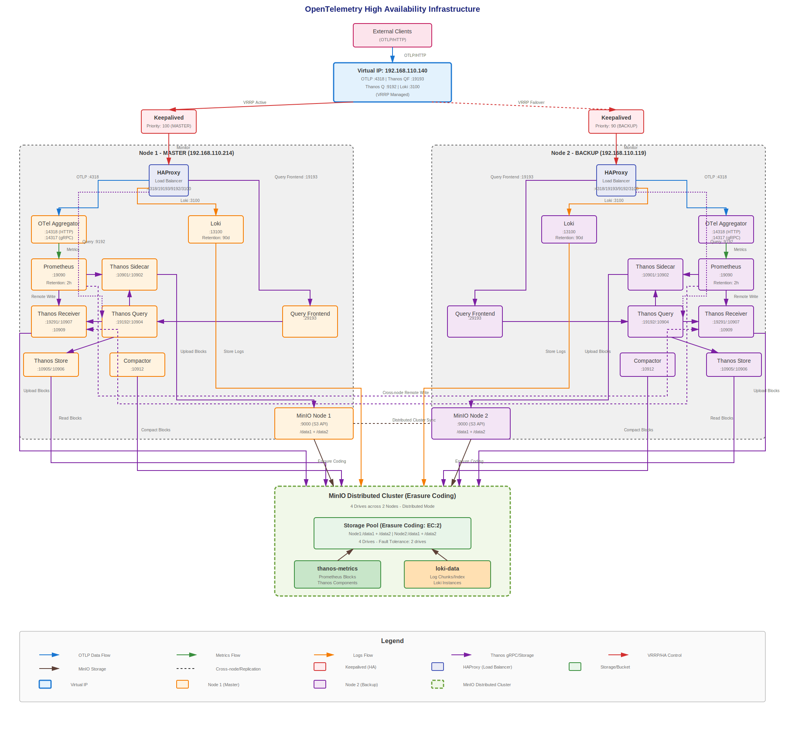

# OpenTelemetry 고가용성 인프라 구성 문서

## 개요

본 문서는 2개의 노드에 걸쳐 배포된 고가용성(HA) OpenTelemetry 인프라 구성을 설명합니다.

## 아키텍처 다이어그램



> SVG 형식의 벡터 다이어그램으로, 브라우저에서 확대/축소해도 선명하게 보입니다.

## 인프라 요약

### 노드 정보

| 노드 | IP 주소 | 역할 | 호스트명 |
|------|---------|------|----------|
| 노드 1 | 192.168.110.214 | MASTER | ish-otel-mid-1.novalocal |
| 노드 2 | 192.168.110.119 | BACKUP | ish-otel-mid-2.novalocal |
| 가상 IP | 192.168.110.140 | 공유 VIP | - |

### 고가용성 구성요소

- **Keepalived**: VRRP 기반 가상 IP 관리
  - 노드 1: 우선순위 100 (MASTER)
  - 노드 2: 우선순위 90 (BACKUP)
  - 라우터 ID: 51
  - 가상 IP: 192.168.110.140

- **HAProxy**: 로드밸런서 및 트래픽 라우팅
  - OTLP HTTP 엔드포인트: 포트 4318
  - 통계 엔드포인트: 포트 8404
  - 백엔드: 로컬 OTel Aggregator 포트 14318

### 서비스 스택

양쪽 노드 모두 동일한 서비스 스택을 실행합니다:

#### 1. OpenTelemetry Collector (Aggregator)
- **이미지**: `cmp-otel-aggregator` (`otel/opentelemetry-collector-contrib:0.139.0` 기반 커스텀 빌드)
- **포트**:
  - 14318/tcp: OTLP HTTP 수신
  - 14317/tcp: OTLP gRPC 수신
  - 9464/tcp: Prometheus 메트릭 엔드포인트
- **기능**:
  - OTLP 메트릭 및 로그 수신
  - batch, memory limiter, resource 프로세서로 처리
  - Prometheus로 메트릭 원격 쓰기로 전송
  - Loki로 로그를 OTLP/HTTP로 전송

#### 2. Prometheus
- **이미지**: `prom/prometheus:v3.7.3`
- **포트**: 9090
- **설정**:
  - 스크랩 간격: 5초
  - 평가 간격: 15초
  - 보존 기간: 15일
  - 블록 지속시간: 2시간 (최소/최대)
  - 외부 레이블: cluster='monitoring-ha', replica='node1'
- **스토리지**: `/data/volume/otel/prometheus`
- **스크랩 대상**:
  - prometheus (자체): 127.0.0.1:9090
  - otel-aggregator: otel-aggregator:9464
  - thanos-sidecar: thanos-sidecar:10902

#### 3. Thanos Sidecar
- **이미지**: `thanosio/thanos:v0.40.1`
- **포트**:
  - 10901: gRPC
  - 10902: HTTP
- **기능**:
  - Prometheus 블록을 MinIO S3 스토리지에 업로드
  - 장기 메트릭 저장 제공
  - 멀티 클러스터 쿼리 지원
- **스토리지 백엔드**: MinIO S3 호환 객체 스토리지
- **버킷**: `thanos-metrics`

#### 4. Loki
- **이미지**: `grafana/loki:3.4.2`
- **포트**: 3100
- **설정**:
  - 스키마: v13 (TSDB)
  - 스토리지: S3 호환 (MinIO)
  - 보존 기간: 90일
  - 버킷: `loki-data`
- **스토리지 경로**:
  - 청크: `/loki/chunks`
  - 룰: `/loki/rules`
  - 인덱스: `/loki/index`
  - 캐시: `/loki/cache`

#### 5. MinIO (분산 모드)
- **이미지**: `cmp-minio` (`minio/minio:RELEASE.2025-02-07T23-21-09Z` 기반 커스텀 빌드)
- **포트**:
  - 9000: S3 API
  - 9001: 웹 콘솔
- **모드**: Erasure Coding을 사용한 분산 모드
- **노드**:
  - `http://192.168.110.214:9000/data{1...2}`
  - `http://192.168.110.119:9000/data{1...2}`
- **버킷**:
  - `loki-data`: Loki 로그 저장소
  - `thanos-metrics`: Thanos 메트릭 저장소
- **노드당 볼륨**:
  - `/data/volume/otel/minio/data1`
  - `/data/volume/otel/minio/data2`

### 네트워크 아키텍처

```
외부 클라이언트
      |
      | OTLP/HTTP
      v
가상 IP (192.168.110.140:4318)
      |
      | VRRP (Keepalived)
      v
+-----+------+
|            |
v            v
노드 1       노드 2
HAProxy      HAProxy
:4318        :4318
|            |
v            v
OTel         OTel
Aggregator   Aggregator
:14318       :14318
|            |
+-----+------+
      |
      +---> Prometheus :9090 (메트릭)
      +---> Loki :3100 (로그)
```

## 데이터 흐름

### 메트릭 파이프라인

1. **수집**: 외부 클라이언트가 VIP:4318로 OTLP 메트릭 전송
2. **로드밸런싱**: HAProxy가 로컬 OTel Aggregator:14318로 전달
3. **처리**: OTel Collector가 다음 프로세서로 처리:
   - Memory limiter (4GB 제한, 1GB 스파이크)
   - Batch 프로세서 (1024 배치 크기)
   - Resource 프로세서 (aggregator 노드 레이블 추가)
4. **저장**:
   - 로컬 Prometheus에 원격 쓰기 API로 메트릭 저장
   - Prometheus는 15일 보존 기간으로 저장
5. **장기 저장**:
   - Thanos Sidecar가 2시간 블록을 MinIO S3에 업로드
   - 4개 데이터 볼륨에 분산 저장 (노드당 2개)

### 로그 파이프라인

1. **수집**: 외부 클라이언트가 VIP:4318로 OTLP 로그 전송
2. **로드밸런싱**: HAProxy가 로컬 OTel Aggregator:14318로 전달
3. **처리**: OTel Collector가 로그 처리
4. **저장**:
   - OTLP/HTTP로 Loki에 로그 전송
   - Loki는 MinIO S3 (loki-data 버킷)에 저장
   - 90일 보존 기간

## 고가용성 기능

### 자동 페일오버

- **Keepalived VRRP**: HAProxy 헬스 모니터링
- **헬스 체크**: `/usr/bin/killall -0 haproxy` 2초마다 실행
- **페일오버 시간**: 약 3초 (advert_int: 1초)
- **인증**: 공유 패스워드를 사용한 PASS 인증

### 데이터 중복성

- **MinIO Erasure Coding**: 4개 데이터 볼륨에 분산
- **Prometheus 블록**: 중복성을 위해 MinIO에 업로드
- **Loki 데이터**: 분산 MinIO 클러스터에 저장

### 헬스 체크

모든 서비스는 포괄적인 헬스 체크를 포함합니다:

| 서비스 | 헬스 체크 엔드포인트 | 간격 | 시작 대기 시간 |
|---------|---------------------|------|---------------|
| HAProxy | 설정 검증 | 10초 | 120초 |
| MinIO | http://127.0.0.1:9000/minio/health/live | 10초 | 120초 |
| OTel Aggregator | http://127.0.0.1:9464/metrics | 10초 | 120초 |
| Prometheus | http://127.0.0.1:9090/-/healthy | 10초 | 120초 |
| Thanos Sidecar | http://127.0.0.1:10902/-/healthy | 10초 | 120초 |
| Loki | http://127.0.0.1:3100/metrics | 10초 | 120초 |

## 설정 파일

### 노드 1 (192.168.110.214)

설정 파일은 `/data/docker/otel/`에 위치하며 `node1-192.168.110.214/`에 백업되어 있습니다:

- `docker-compose.yaml`: 메인 오케스트레이션 파일
- `.env`: 노드별 환경 변수
- `Dockerfile`: OTel Collector 커스텀 이미지
- `haproxy/haproxy.cfg`: HAProxy 설정
- `keepalived/keepalived.conf.template`: Keepalived 템플릿
- `keepalived/setup-keepalived.sh`: Keepalived 초기화 스크립트
- `loki/config.yaml`: Loki 설정
- `minio/Dockerfile`: MinIO 커스텀 이미지
- `minio/run.sh`: MinIO 초기화 및 버킷 설정 스크립트
- `otel-collector/config.yaml`: OTel Collector 파이프라인 설정
- `prometheus/prometheus.yml`: Prometheus 스크랩 설정
- `thanos/bucket.yml`: Thanos S3 버킷 설정

### 노드 2 (192.168.110.119)

설정 파일은 노드 1과 동일하며, `.env` 파일만 다릅니다:

- `NODE_NAME=mid-2` (vs `mid-1`)
- `NODE_IP=192.168.110.119` (vs `192.168.110.214`)
- `PEER_IP=192.168.110.214` (vs `192.168.110.119`)
- `KEEPALIVED_PRIORITY=90` (vs `100`)
- `KEEPALIVED_STATE=BACKUP` (vs `MASTER`)

모든 설정 파일은 `node2-192.168.110.119/`에 백업되어 있습니다.

## 볼륨 매핑

### 노드 1 & 노드 2 (동일)

| 서비스 | 컨테이너 경로 | 호스트 경로 |
|---------|--------------|------------|
| Prometheus | `/prometheus` | `/data/volume/otel/prometheus` |
| Thanos | `/prometheus` | `/data/volume/otel/prometheus` |
| Thanos | `/thanos` | `/data/volume/otel/thanos` |
| Loki | `/loki` | `/data/otel/volume/loki` |
| MinIO | `/data1` | `/data/volume/otel/minio/data1` |
| MinIO | `/data2` | `/data/volume/otel/minio/data2` |

## 포트 매트릭스

| 서비스 | 노드 1 | 노드 2 | 프로토콜 | 용도 |
|---------|--------|--------|----------|------|
| VIP (HAProxy) | 192.168.110.140:4318 | 192.168.110.140:4318 | HTTP | OTLP HTTP 수집 |
| HAProxy 통계 | :8404 | :8404 | HTTP | HAProxy 통계 |
| OTel Aggregator HTTP | :14318 | :14318 | HTTP | OTLP HTTP 수신 |
| OTel Aggregator gRPC | :14317 | :14317 | gRPC | OTLP gRPC 수신 |
| OTel 메트릭 | :9464 | :9464 | HTTP | Prometheus 스크랩 엔드포인트 |
| Prometheus | :9090 | :9090 | HTTP | Prometheus API/UI |
| Thanos gRPC | :10901 | :10901 | gRPC | Thanos 쿼리 프로토콜 |
| Thanos HTTP | :10902 | :10902 | HTTP | Thanos HTTP API |
| Loki | :3100 | :3100 | HTTP | Loki API |
| MinIO S3 | :9000 | :9000 | HTTP | S3 호환 API |
| MinIO 콘솔 | :9001 | :9001 | HTTP | 웹 UI |

## 컨테이너 상태

### 노드 1 (192.168.110.214)

모든 컨테이너 실행 중 및 정상:
- haproxy-mid-1
- thanos-sidecar-mid-1
- loki-mid-1
- prometheus-mid-1
- minio-mid-1
- keepalived-mid-1
- otel-aggregator-mid-1

### 노드 2 (192.168.110.119)

모든 컨테이너 실행 중 및 정상:
- haproxy-mid-2
- thanos-sidecar-mid-2
- loki-mid-2
- prometheus-mid-2
- minio-mid-2
- keepalived-mid-2
- otel-aggregator-mid-2

## 배포 방법

### 사전 요구사항

1. 양쪽 노드에 Docker 및 Docker Compose 설치
2. 노드 간 네트워크 연결 (192.168.110.214와 192.168.110.119)
3. `/data/volume/otel/` 및 `/data/otel/volume/`에 스토리지 볼륨 생성

### 배포 단계

1. **각 노드에서** 디렉토리 구조 생성:
   ```bash
   mkdir -p /data/docker/otel
   cd /data/docker/otel
   ```

2. **설정 파일 복사**:
   - 노드 1: `node1-192.168.110.214/`의 파일 사용
   - 노드 2: `node2-192.168.110.119/`의 파일 사용

3. **커스텀 이미지 빌드**:
   ```bash
   docker-compose build
   ```

4. **서비스 시작**:
   ```bash
   docker-compose up -d
   ```

5. **상태 확인**:
   ```bash
   docker-compose ps
   docker-compose logs -f
   ```

### 페일오버 테스트

1. **현재 VIP 소유자 확인**:
   ```bash
   ip addr show | grep 192.168.110.140
   ```

2. **마스터에서 Keepalived 중지**:
   ```bash
   docker stop keepalived-mid-1
   ```

3. **VIP가 백업으로 이동했는지 확인**:
   ```bash
   # 노드 2에서
   ip addr show | grep 192.168.110.140
   ```

4. **OTLP 수집 테스트**:
   ```bash
   curl -X POST http://192.168.110.140:4318/v1/metrics \
     -H "Content-Type: application/json" \
     -d '{"resourceMetrics":[]}'
   ```

## 모니터링 및 관찰성

### 접속 포인트

- **HAProxy 통계**: http://192.168.110.214:8404/stats (노드 1) 또는 http://192.168.110.119:8404/stats (노드 2)
- **Prometheus UI**: http://192.168.110.214:9090 (노드 1) 또는 http://192.168.110.119:9090 (노드 2)
- **MinIO 콘솔**: http://192.168.110.214:9001 (노드 1) 또는 http://192.168.110.119:9001 (노드 2)
- **OTel 메트릭**: http://192.168.110.214:9464/metrics (노드 1) 또는 http://192.168.110.119:9464/metrics (노드 2)
- **Thanos Sidecar**: http://192.168.110.214:10902 (노드 1) 또는 http://192.168.110.119:10902 (노드 2)

### 모니터링 필수 메트릭

- **Keepalived**: VIP 소유권, VRRP 상태
- **HAProxy**: 백엔드 헬스, 요청률, 응답 시간
- **OTel Collector**: 수신된/거부된 메트릭, 전송/실패한 내보내기 메트릭
- **Prometheus**: 수집률, 스토리지 사용량, 쿼리 지연 시간
- **Thanos**: 업로드 성공률, 블록 압축 상태
- **Loki**: 수집률, 쿼리 성능
- **MinIO**: 스토리지 사용량, API 지연 시간, erasure coding 상태

## 트러블슈팅

### 일반적인 문제

1. **VIP가 응답하지 않음**:
   - Keepalived 로그 확인: `docker logs keepalived-mid-1`
   - 양쪽 노드에서 VRRP 인증이 일치하는지 확인
   - VRRP 방화벽 규칙 확인 (프로토콜 112)

2. **HAProxy 백엔드 다운**:
   - OTel Aggregator 헬스 체크: `curl http://127.0.0.1:9464/metrics`
   - HAProxy 로그 확인: `docker logs haproxy-mid-1`

3. **MinIO 버킷 생성 실패**:
   - MinIO 로그 확인: `docker logs minio-mid-1`
   - 노드 간 분산 모드 연결 확인
   - 포트 9000의 네트워크 연결 확인

4. **Thanos가 블록 업로드하지 않음**:
   - MinIO 버킷 액세스 확인: `thanos/bucket.yml` 자격증명 확인
   - Thanos 로그 확인: `docker logs thanos-sidecar-mid-1`
   - Prometheus 블록 생성 확인: `/data/volume/otel/prometheus` 확인

5. **Loki 수집 문제**:
   - Loki 로그 확인: `docker logs loki-mid-1`
   - MinIO 버킷 권한 확인
   - OTel Collector 내보내기 설정 확인

## 보안 고려사항

### 현재 구성

- MinIO는 하드코딩된 자격증명 사용 (정기적으로 교체해야 함)
- Keepalived 인증은 공유 패스워드 사용
- 모든 서비스가 호스트 네트워크 모드 실행 (network_mode: host)
- TLS/SSL 암호화 미구성 (insecure: true)

### 권장사항

1. **TLS 활성화**:
   - 모든 HTTP 엔드포인트에 TLS 구성
   - 적절한 인증서 사용 (프로덕션에서는 자체 서명 인증서 사용 금지)

2. **시크릿 관리**:
   - Docker secrets 또는 외부 시크릿 관리자 사용
   - MinIO 자격증명 정기적으로 교체
   - 강력하고 고유한 패스워드 사용

3. **네트워크 격리**:
   - 호스트 모드 대신 Docker 네트워크 사용 고려
   - 접근 제한을 위한 방화벽 규칙 구현
   - 노드 간 통신에 VPN 또는 프라이빗 네트워크 사용

4. **접근 제어**:
   - Prometheus 및 Loki에 인증 활성화
   - MinIO 콘솔 접근 제한
   - 역할 기반 접근 제어(RBAC) 구현

## 백업 및 재해 복구

### 데이터 백업

1. **MinIO 데이터**:
   - 양쪽 노드의 `/data/volume/otel/minio/` 정기적으로 백업
   - 외부 스토리지로 MinIO 버킷 복제 고려

2. **Prometheus 데이터**:
   - Thanos가 MinIO에 장기 저장소 제공
   - MinIO `thanos-metrics` 버킷 백업

3. **Loki 데이터**:
   - MinIO `loki-data` 버킷에 저장
   - 버킷 백업 또는 멀티 사이트 복제 구성

4. **설정 파일**:
   - 모든 파일이 `node1-192.168.110.214/` 및 `node2-192.168.110.119/`에 백업됨
   - 버전 관리 권장 (Git)

### 재해 복구 절차

1. **단일 노드 장애**:
   - Keepalived가 자동으로 백업 노드로 페일오버
   - 수동 개입 불필요
   - 장애 노드 교체 및 클러스터에 재합류

2. **전체 클러스터 장애**:
   - 백업에서 MinIO 데이터 볼륨 복원
   - 저장된 설정 파일을 사용하여 컨테이너 배포
   - MinIO 분산 모드 연결 확인
   - 순서대로 서비스 시작: MinIO → Prometheus/Loki → Thanos → OTel → HAProxy → Keepalived

3. **데이터 손상**:
   - MinIO erasure coding이 보호 제공
   - 여러 노드에 영향을 주는 손상인 경우 백업에서 복원
   - 메트릭 복구를 위해 Thanos 압축 로그 확인

## 성능 튜닝

### 현재 설정

- **OTel Collector**:
  - 메모리 제한: 4GB (스파이크: 1GB)
  - 배치 크기: 1024 (최대: 2048)
  - 배치 타임아웃: 10초

- **Prometheus**:
  - 스크랩 간격: 5초
  - 보존 기간: 15일
  - 블록 지속시간: 2시간

- **Loki**:
  - 보존 기간: 90일

### 최적화 권장사항

1. **높은 처리량 발생 시 배치 크기 증가**
2. **메트릭 카디널리티에 따라 스크랩 간격 조정**
3. **스토리지 용량에 따라 보존 기간 조정**
4. **더 나은 격리를 위해 docker-compose에 리소스 제한 구성**
5. **OTel Collector 내보내기에서 압축 활성화**

## 향후 개선사항

1. **Grafana 통합**: 시각화를 위한 Grafana 추가
2. **Alertmanager**: 알림을 위한 Prometheus Alertmanager 통합
3. **Thanos Query**: 글로벌 뷰를 위한 Thanos Query 컴포넌트 배포
4. **멀티 사이트 복제**: 지리적 중복성을 위한 세 번째 사이트 추가
5. **Kubernetes 마이그레이션**: 더 나은 오케스트레이션을 위해 Kubernetes로 마이그레이션 고려
6. **서비스 메시**: 트래픽 관리를 위한 Istio 또는 Linkerd 구현
7. **중앙화된 로깅**: 시스템 로그 수집을 위한 Promtail 추가

## 참고 문서

- OpenTelemetry Collector: https://opentelemetry.io/docs/collector/
- Prometheus: https://prometheus.io/docs/
- Thanos: https://thanos.io/
- Loki: https://grafana.com/docs/loki/
- MinIO: https://min.io/docs/
- HAProxy: http://www.haproxy.org/
- Keepalived: https://www.keepalived.org/

## 연락처 및 지원

본 인프라 관련 문의사항:

1. 로그 확인: `docker-compose logs -f [서비스명]`
2. 헬스 체크 확인: `docker-compose ps`
3. 본 문서 참조
4. 업스트림 프로젝트 문서 검토

---

**최종 업데이트**: 2025-11-14
**인프라 버전**: 1.0
**관리자**: 인프라 팀
